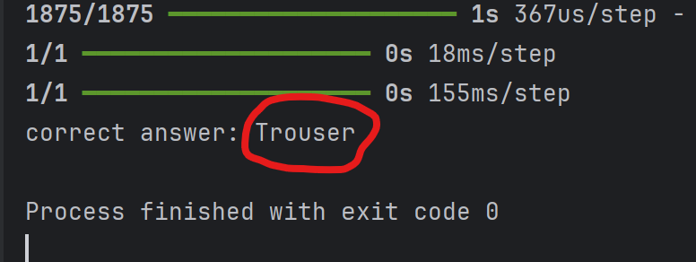

# nvidiaCourses-1-Building-A-Brain-In-10-Minutes
NVIDIA's DLI Course - "Building A Brain In 10 Minutes"

A brief machine learning demonstration from NNVIDIA's DLI Course - "Building A Brain In 10 Minutes" (linked below)

https://learn.nvidia.com/courses/course-detail?course_id=course-v1:DLI+T-FX-01+V1

Code can analyze images from fashion_mnist dataset and determine clothing type.

```python 
categories = [(0, "T-shirt/top"), (1, "Trouser"), (2, "Pullover"), (3, "Dress"), (4, "Coat"),
           (5, "Sandal"), (6, "Shirt"), (7, "Sneaker"), (8, "Bag"), (9, "Ankle boot")]
```

Example:

>
>
>
